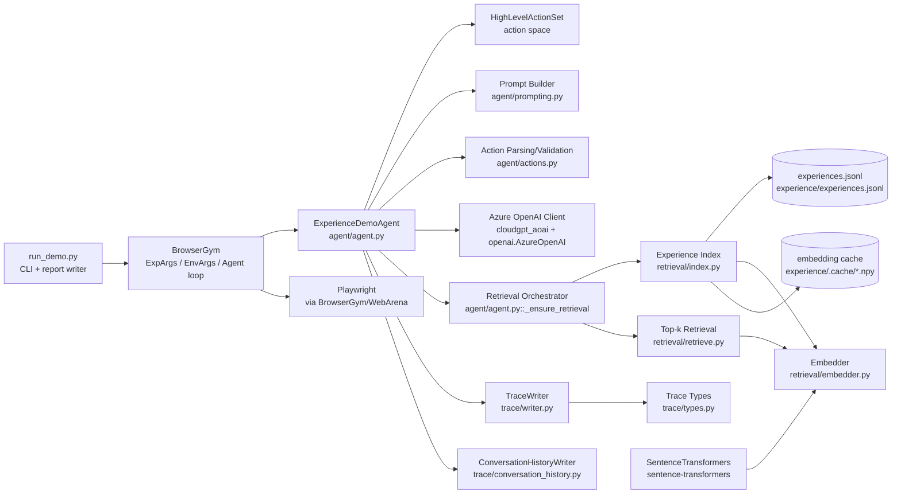
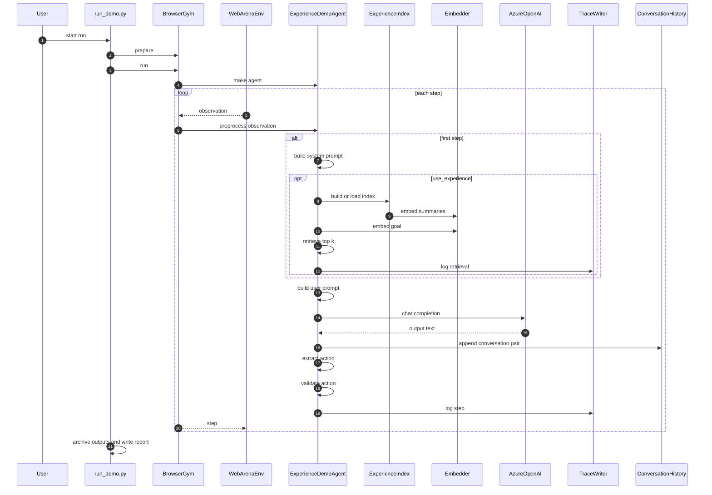

# Experience Demo — Architecture Diagrams

This file contains **two Mermaid diagrams**:

1. Component diagram (modules and external dependencies)
2. Runtime sequence diagram (one episode / step loop)

---

## 1) Component diagram (modules)

---

## 2) Runtime sequence diagram (one run)

