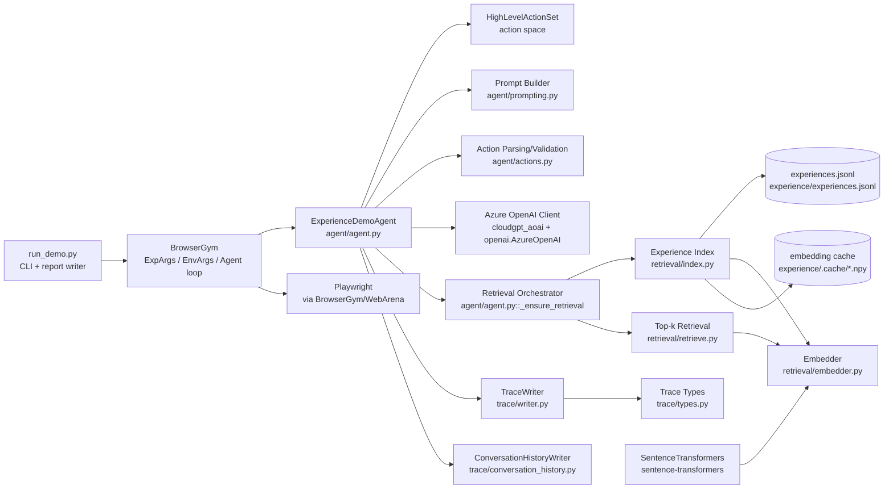

# Experience Demo
## Architecture Overview (Compact)

**Scope**: `webarena/demo/experience_demo`

---

## What this demo proves

- A minimal loop to compare two agent modes on the same WebArena task
  - **Baseline**: no retrieval / no prompt injection
  - **With-Experience**: retrieve top-k experiences and inject into system prompt
- Produces reproducible artifacts (trace + report) for debugging

---

## Key idea (one sentence)

Use the task **goal** as a retrieval query to fetch relevant procedural knowledge,
then prepend it to the LLM's system prompt as actionable rules.

---

## Modules (map)

- `run_demo.py` — CLI runner + report writer
- `agent/agent.py` — agent loop (LLM call + optional retrieval + action validation)
- `agent/prompting.py` — system/user prompt templates
- `agent/actions.py` — extract `<action>...</action>` and validate via action set
- `retrieval/*` — embedding + index cache + top-k retrieval
- `trace/*` — JSONL trace + conversation history

---

## `run_demo.py`: what happens

- Parse flags (`--use_experience`, `--top_k`, `--obs_mode`, `--think_prompt`)
- Create BrowserGym `EnvArgs` + `ExpArgs`
- Run once or as a suite (baseline + with-exp)
- Archive experiment outputs and write:
  - `report.json` (structured)
  - `report.md` (summary)

---

## `ExperienceDemoAgent`: responsibilities

- Convert observations into prompt-friendly text (AXTree/DOM)
- Build system prompt once per episode
- For each step:
  - build user prompt (step/url/observation)
  - call LLM
  - parse/validate action; retry if invalid
- Log retrieval + step traces

---

## Retrieval mechanism (minimal)

Inputs:

- Query: **goal**
- Documents: experience **summary**
- Output injected: experience **content**

Similarity:

- cosine via dot product on L2-normalized vectors

---

## Retrieval modules (how)

- `retrieval/embedder.py`
  - SentenceTransformer encoder
  - row-wise L2 normalization
- `retrieval/index.py`
  - load `experience/experiences.jsonl`
  - cache embeddings under `experience/.cache/` keyed by (model, fingerprint)
- `retrieval/retrieve.py`
  - top-k by `embeddings @ query_vec`

---

## Prompt injection (where)

- `agent/prompting.py::build_system_prompt(...)`
  - Baseline: no extra block
  - With-Experience: append a "Retrieved Experiences" block containing top-k `content`

Output contract enforced by the demo:

- last line must be: `<action>...</action>`
- optional: `<think>...</think>` when `--think_prompt true`

---

## Action robustness (retry)

- `agent/actions.py` extracts ONLY from `<action>...</action>`
- `validate_action(...)` uses BrowserGym action parser
- On failure: append a short "Correction" instruction and retry
- Fallback: `noop(500)` if all retries fail

---

## Tracing & debugging artifacts

Under the run's `.../logs/`:

- `trace/trace.jsonl`
  - `retrieval` events: query/top_k/results
  - `step` events: prompts, LLM output, action validity
- `conversation_history/conversation_history.json`
  - full user/assistant pairs for the entire run

---

## Measuring effect (what to look at)

- `report.json` / `report.md` contain:
  - per-run `success` and `summary_info`
  - `success_rate.baseline` vs `success_rate.with_exp`

Interpretation:

- If retrieval helps, you should see higher `with_exp` success rate across runs.
- If not, use `trace.jsonl` + conversation history to diagnose:
  - retrieval quality (summary/content)
  - prompt compliance / invalid actions

---

## How to export

- VS Code + Marp extension: export PDF/PPTX
- Marp CLI:
  - `npx @marp-team/marp-cli src/slides_compact.md --pdf`
  - `npx @marp-team/marp-cli src/slides_compact.md --pptx`
